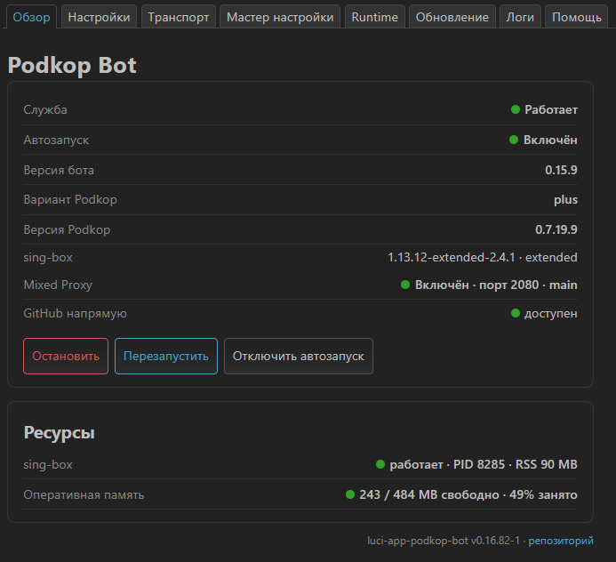
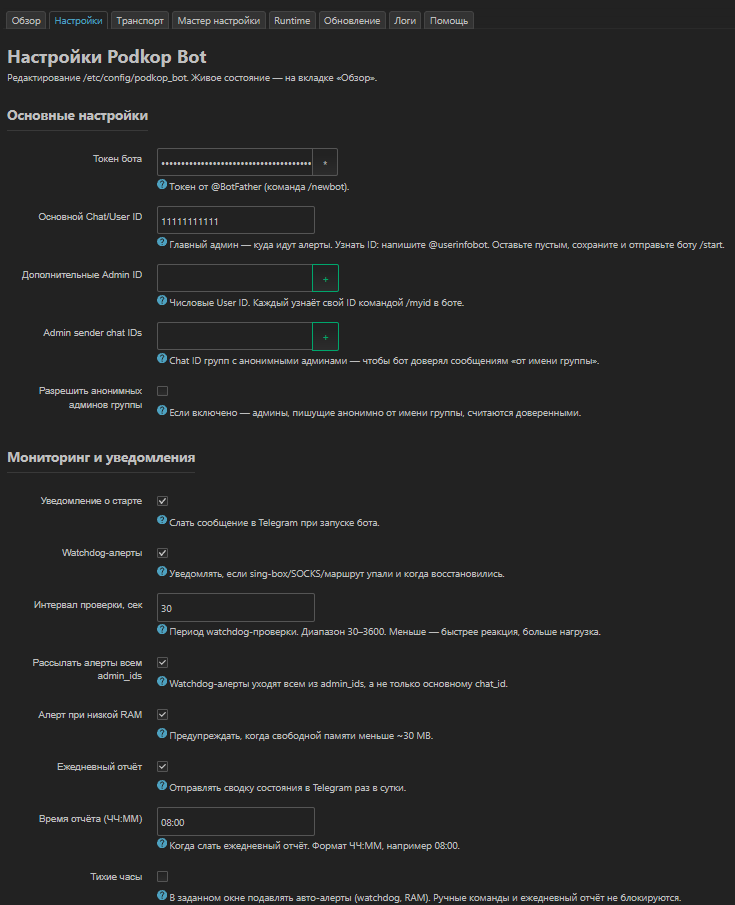
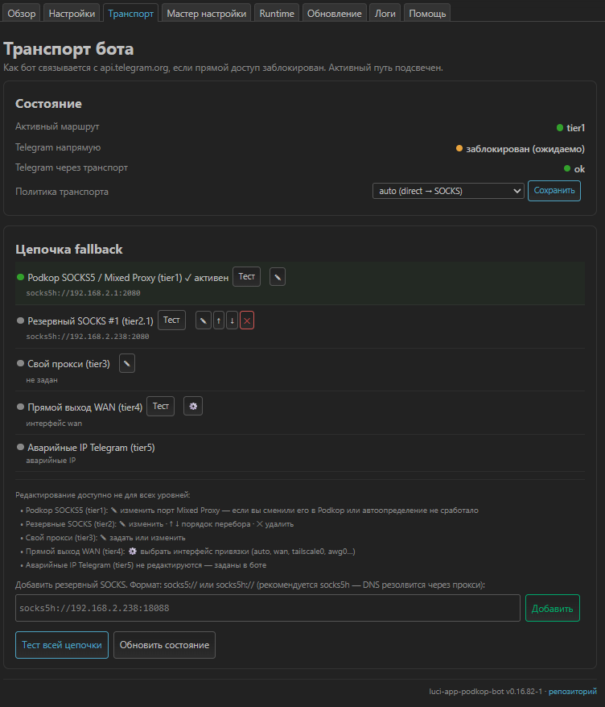
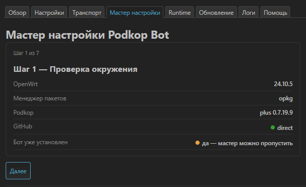
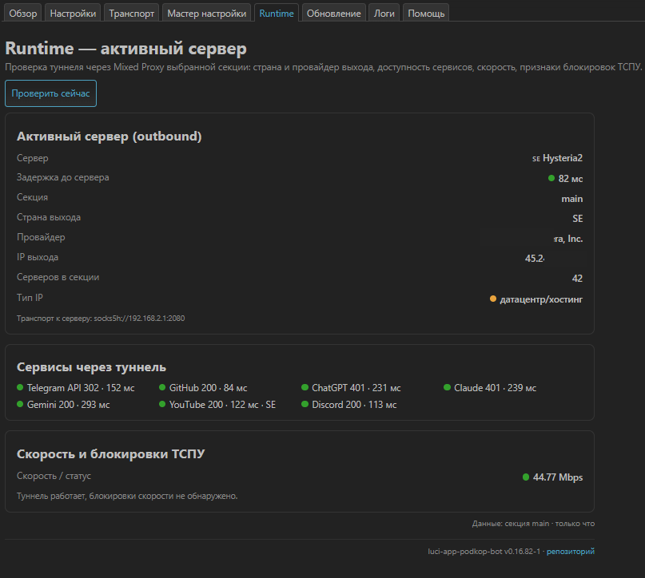
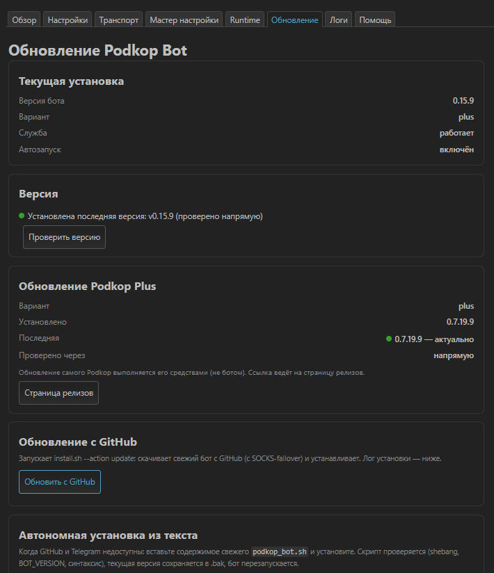

# luci-app-podkop-bot

LuCI веб-интерфейс для управления Telegram-ботом [**podkop_bot**](https://github.com/Medvedolog/podkop_bot) на роутерах OpenWrt.

Приложение управляет **только ботом** (установка, восстановление, обновление, диагностика, просмотр состояния). Оно читает конфигурацию Podkop и его форков исключительно для отображения транспорта, Mixed Proxy и диагностики — сам Podkop приложение не настраивает и не обновляет. Повседневное управление туннелями удобнее вести в самом Telegram-боте; этот интерфейс нужен для настройки, восстановления и наблюдения через веб.

## Как это устроено

Приложение — это **тонкий веб-слой поверх двух исполнителей**:

- **rpcd-бэкенд** (`/usr/libexec/rpcd/podkop_bot`) — принимает вызовы от вкладок LuCI и переводит их в действия.
- **install.sh** (`/usr/lib/podkop_bot/install.sh`) — установщик и «швейцарский нож» бота, который делает всю тяжёлую работу.

Frontend сам ничего не устанавливает и не меняет в системе напрямую — он только вызывает эти два компонента и отображает результат.

### Роль install.sh

`install.sh` — это тот же скрипт, что живёт в репозитории [podkop_bot](https://github.com/Medvedolog/podkop_bot); приложение носит его копию, чтобы управлять ботом без обращения к сети. Это POSIX-ash скрипт (совместим с BusyBox), запускаемый в неинтерактивном режиме (`--unattended --action <действие>`). Поддерживаемые действия:

- **`status`** — возвращает JSON о текущем состоянии: установлен ли бот, запущен ли, версия бота, вариант и версия Podkop, менеджер пакетов (opkg/apk), версия OpenWrt, версия самого установщика, наличие конфига и токена. Это источник данных почти для всех вкладок, поэтому результат кэшируется, чтобы обновление страницы не било по системе.
- **`install`** — устанавливает бота (размещает, настраивает автозапуск). Файлы бота берутся из локальной vendor-копии в `/usr/lib/podkop_bot`, поэтому установка и восстановление работают даже без доступа к сети. При уже установленном боте автоматически превращается в `update`.
- **`update`** — обновляет бота до свежей версии с GitHub.
- **`check`** / **`check-token`** — проверки окружения и валидности токена бота.
- **`uninstall`** — удаление бота.

rpcd вызывает `install.sh` для операций со службой и конфигом (`uci get/set podkop_bot.settings.*`), а также сам определяет активную routing-секцию Podkop и параметры Mixed Proxy. Разделение ответственности жёсткое: **приложение управляет ботом, но не трогает сам Podkop** — обновление и настройку Podkop делает сам Podkop.

## Вкладки

### Обзор
Живая сводка состояния: работает ли служба, включён ли автозапуск, версии бота / Podkop / sing-box, состояние Mixed Proxy (порт и секция), доступность GitHub напрямую. Кнопки управления службой: запустить, остановить, перезапустить, включить/выключить автозапуск. Блок «Ресурсы» показывает статус sing-box (PID, RSS) и загрузку оперативной памяти. Если бот не установлен — предлагает перейти в Мастер. Если версия Podkop ниже 0.7.0 — показывает предупреждение об устаревшей версии и гасит несовместимые функции.

### Настройки
Параметры бота: токены, ID администраторов, доверенные группы (anonymous admins), мониторинг и уведомления. Раздел «Опасные действия» с необратимыми операциями (остановить бота, очистить конфиг) — под явным подтверждением.

### Транспорт
Как бот ходит в Telegram и на GitHub: состояние транспорта, политика (`auto` / прямое / через прокси), активная routing-секция. Показывает цепочку fallback (например, Podkop SOCKS5 / Mixed Proxy → прямое), какое звено сейчас активно, и дополнительные SOCKS-секции Podkop. Есть тест всей цепочки.

### Мастер настройки
Пошаговая установка/восстановление бота (7 шагов): проверка окружения (OpenWrt, менеджер пакетов, вариант Podkop, доступность GitHub, установлен ли уже бот), ввод токена и параметров, применение. Если бот уже установлен, мастер можно пропустить.

### Runtime
Диагностика туннеля по секциям. Показывает активный сервер (outbound): протокол, флаг страны, задержку, секцию, страну выхода, провайдера (ASN), IP выхода, тип IP (датацентр/резидентный), число серверов в секции, транспорт к серверу. Ниже — «Сервисы через туннель» (Telegram API, GitHub, ChatGPT, Claude, Gemini, YouTube, Discord с кодами ответа и задержками), скорость и статус блокировок ТСПУ. Можно проверить активную/выбранную/все секции и включить Mixed Proxy для конкретной секции.

### Обновление
Хаб обновлений трёх независимых модулей, по карточке на каждый:

- **Веб-интерфейс (LuCI)** — показывает установленную версию приложения и сверяет её с последней в репозитории по сети (с fallback: напрямую, а если GitHub заблокирован — через tier1 SOCKS бота). Если в репозитории версия новее, появляется кнопка «Скачать релиз». Приложение себя не обновляет — только ведёт на страницу релизов.
- **Telegram-бот** — версия бота (установлено vs последняя) и все способы его обновления в одном месте:
  - *Обновление с GitHub* — запускает `install.sh --action update`, скачивает свежий бот с GitHub (с SOCKS-fallback) и устанавливает, показывая лог.
  - *Автономная установка из текста* (сворачиваемый блок) — на случай, когда и GitHub, и Telegram недоступны: вставьте содержимое свежего `podkop_bot.sh` целиком. Скрипт проверяется (shebang, `BOT_VERSION`, синтаксис), текущая версия сохраняется в `.bak`, бот перезапускается. Установщик размещает бот из локальной vendor-копии (`/usr/lib/podkop_bot`), поэтому сеть для самого размещения не нужна.
- **Podkop** — вариант, установленная и последняя версии, ссылка на релизы. Обновление самого Podkop выполняется его средствами, не ботом.

Ниже — «Удаление бота» (`install.sh --action uninstall`) под подтверждением `REMOVE`.

### Логи
Просмотр логов бота (50/100/200/500 строк), обновление, скачивание. Support Bundle с маскировкой чувствительных данных.

### Справка
Назначение приложения, его границы («управляет ботом, не Podkop») и краткое описание каждого раздела.

## Скриншоты

| | | |
|:---:|:---:|:---:|
|  |  |  |
| Обзор | Транспорт | Runtime |
|  |  |  |
| Обновление | Настройки | Мастер настройки |

## Установка

### opkg (OpenWrt ≤ 24.10 и совместимые)

```sh
opkg update
opkg install luci-app-podkop-bot_<версия>_all.ipk
```

### apk (OpenWrt 25+)

```sh
apk add --allow-untrusted luci-app-podkop-bot_<версия>_noarch.apk
```

Готовые пакеты — на странице [Releases](../../releases). После установки очистите кэш LuCI (приложение делает это в postinst автоматически) и при необходимости обновите страницу.

### Зависимости

`libc`, `luci-base`, `jq`.

## Совместимость

Требуется установленный **podkop_bot** и один из вариантов Podkop. Функции вроде Mixed Proxy требуют Podkop **0.7.0 и новее** — на более старых версиях интерфейс показывает предупреждение и отключает несовместимые возможности.

## Связанные проекты

**Бот:**
- [Medvedolog/podkop_bot](https://github.com/Medvedolog/podkop_bot) — сам Telegram-бот, которым управляет это приложение.

**Podkop и форки** (приложение автоопределяет вариант):
- [itdoginfo/podkop](https://github.com/itdoginfo/podkop) — основной проект Podkop: маршрутизация трафика для OpenWrt на базе sing-box (нужное в туннель, остальное напрямую).
- [ushan0v/podkop-plus](https://github.com/ushan0v/podkop-plus) — форк **Podkop Plus** на базе последних бета-версий podkop: использует поле `action`; подписка — это источник, а режим (`selector`/`urltest`) задаётся отдельными флагами. Позволяет поднять VPN/Proxy-сервер прямо на роутере.
- [yandexru45/netshift](https://github.com/yandexru45/netshift) — форк **NetShift** (бывший podkop-evolution): переименование podkop → NetShift со своей структурой путей и пространством имён UCI, авто-миграция конфигов, поддержка Subscription URL и sing-box-extended (xhttp).

## Changelog

История изменений — в [CHANGELOG.md](CHANGELOG.md).

## Сборка

Пакет не требует компиляции (JS/shell/config, arch `all`/`noarch`). Сборка IPK и APK выполняется через [nFPM](https://nfpm.goreleaser.com/) в GitHub Actions (`Build and Release`). Конфигурация пакета — в `nfpm.yaml`; полезная нагрузка — в `root/`; maintainer-скрипты — в `scripts/`.


## Лицензия

GPL-2.0-or-later.
