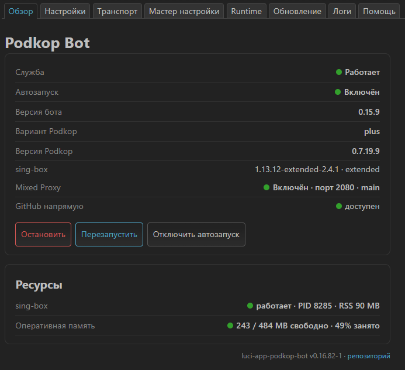
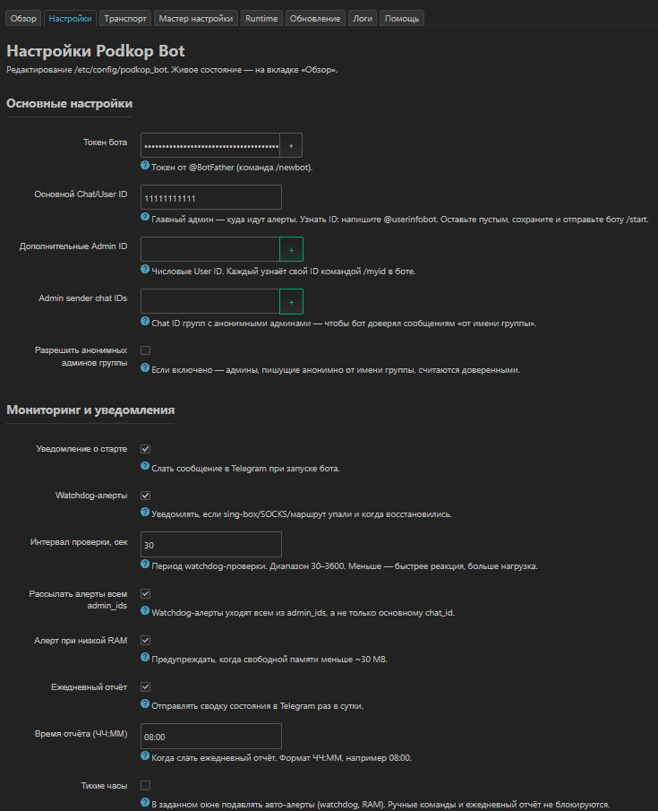
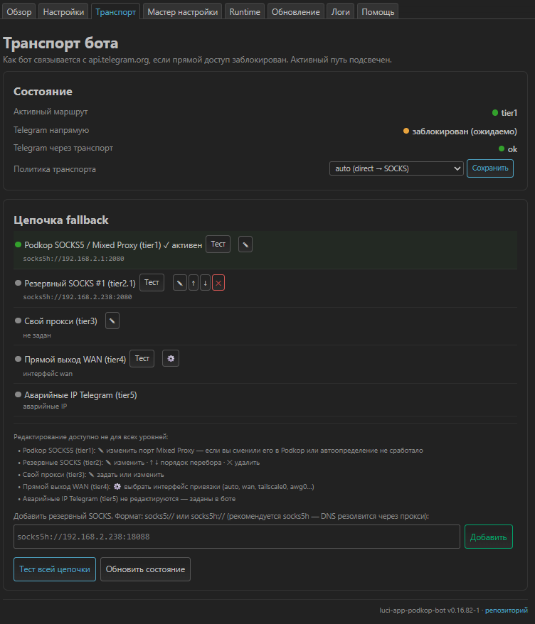
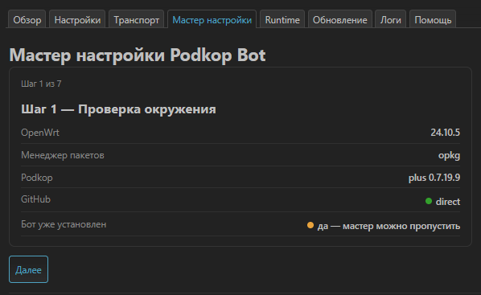
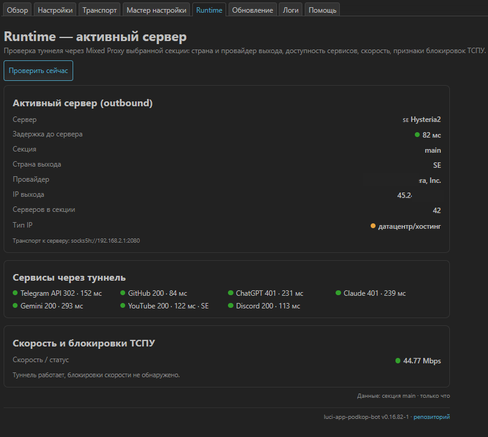
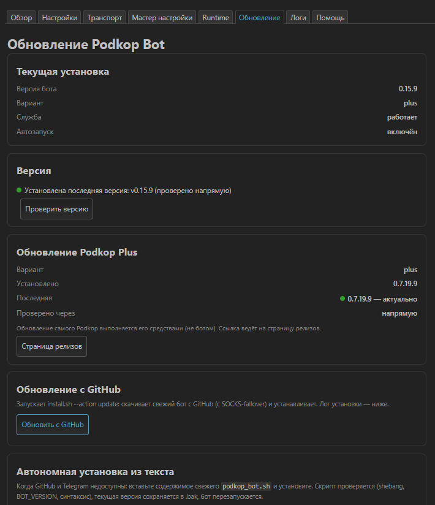

# luci-app-podkop-bot

LuCI веб-интерфейс для управления Telegram-ботом [**podkop_bot**](https://github.com/Medvedolog/podkop_bot) на роутерах OpenWrt.

Приложение в первую очередь управляет **Telegram-ботом** (установка, восстановление, обновление, диагностика, просмотр состояния). Конфигурацию маршрутизации Podkop и его форков оно не редактирует: читает её для транспорта, Mixed Proxy и диагностики. Единственное прямое действие над самим Podkop — явное обновление выбранного варианта его штатным `install.sh` из вкладки «Обновление».

## Скриншоты

| | | |
|:---:|:---:|:---:|
|  |  |  |
| Обзор | Настройки | Транспорт |
|  |  |  |
| Мастер настройки | Runtime | Обновление |

## Как это устроено

Приложение — это **тонкий веб-слой поверх двух исполнителей**:

- **rpcd-бэкенд** (`/usr/libexec/rpcd/podkop_bot`) — принимает вызовы от вкладок LuCI и переводит их в действия.
- **install.sh** (`/usr/lib/podkop_bot/install.sh`) — установщик и «швейцарский нож» бота, который делает всю тяжёлую работу.

Frontend сам ничего не устанавливает и не меняет в системе напрямую — он только вызывает эти два компонента и отображает результат.

### Роль install.sh

`install.sh` — это тот же скрипт, что живёт в репозитории [podkop_bot](https://github.com/Medvedolog/podkop_bot); приложение носит его копию, чтобы управлять ботом без обращения к сети. Это POSIX-ash скрипт (совместим с BusyBox), запускаемый в неинтерактивном режиме (`--unattended --action <действие>`). Поддерживаемые действия:

- **`status`** — возвращает JSON о текущем состоянии: установлен ли бот, запущен ли, версия бота, вариант и версия Podkop, менеджер пакетов (opkg/apk), версия OpenWrt, версия самого установщика, наличие конфига и токена. Это источник данных почти для всех вкладок, поэтому результат кэшируется, чтобы обновление страницы не било по системе.
- **`install`** — устанавливает бота (размещает, настраивает автозапуск). Файлы бота по умолчанию берутся с GitHub (для онлайн-обновления до свежей версии), а при недоступности сети (прямой доступ и SOCKS) используется встроенная vendor-копия в `/usr/lib/podkop_bot` как аварийный fallback — установка и восстановление работают и без доступа к сети. При уже установленном боте автоматически превращается в `update`.
- **`update`** — обновляет бота до свежей версии с GitHub.
- **`check`** / **`check-token`** — проверки окружения и валидности токена бота.
- **`uninstall`** — удаление бота.

rpcd вызывает `install.sh` для операций со службой и конфигом (`uci get/set podkop_bot.settings.*`), а также сам определяет активную routing-секцию Podkop и параметры Mixed Proxy. Разделение ответственности сохраняется: приложение не редактирует routing-конфигурацию Podkop. Отдельная кнопка обновления лишь запускает штатный установщик автоматически определённого форка; повседневная настройка секций остаётся в Podkop/Forkop и Telegram-боте.

## Вкладки

### Обзор
Живая сводка состояния: работает ли служба, включён ли автозапуск, версии бота / Podkop / sing-box, состояние Mixed Proxy (порт и секция), доступность GitHub напрямую. Кнопки управления службой: запустить, остановить, перезапустить, включить/выключить автозапуск. Блок «Ресурсы» показывает статус sing-box (PID, RSS) и загрузку оперативной памяти. Если бот не установлен — предлагает перейти в Мастер. Если версия Podkop ниже 0.7.0 — показывает предупреждение об устаревшей версии и гасит несовместимые функции.

### Настройки
Параметры бота: токены, ID администраторов, доверенные группы (anonymous admins), мониторинг и уведомления. Раздел «Опасные действия» с необратимыми операциями (остановить бота, очистить конфиг) — под явным подтверждением.

### Транспорт
Как бот ходит в Telegram и на GitHub: состояние транспорта, политика (`auto` / прямое / через прокси), активная routing-секция. Показывает цепочку fallback (например, Podkop SOCKS5 / Mixed Proxy → прямое), какое звено сейчас активно, и дополнительные SOCKS-секции Podkop. Есть тест всей цепочки.

### Мастер настройки
Пошаговая установка/восстановление бота (7 шагов): проверка окружения (OpenWrt, менеджер пакетов, вариант Podkop, доступность GitHub, установлен ли уже бот), ввод токена и параметров, применение. Если бот уже установлен, мастер можно пропустить.

### Runtime
Диагностика туннеля по секциям. Показывает активный сервер (outbound): протокол, флаг страны, задержку, секцию, страну выхода, провайдера (ASN), IP выхода, тип IP (датацентр/резидентный), число серверов в секции, транспорт к серверу. Ниже — «Сервисы через туннель»: двенадцать сервисов (Telegram API, GitHub, Claude, YouTube, ChatGPT, Gemini, Netflix, Spotify, TikTok, Twitch, Apple, Discord) с кодами ответа и задержками. Для части из них показывается регион, который сервис видит на выходе туннеля: YouTube, ChatGPT, Netflix, Spotify, TikTok и Twitch — код страны, Gemini — доступность в регионе (✓/✗). Проверки идут параллельно с общим лимитом ~15 секунд; не успевшие помечаются N/A. Ещё есть тест скорости (через speed.cloudflare.com, с fallback на fast.com) и статус блокировок ТСПУ. Определение выхода (IP/страна/провайдер) устойчиво к отказу одного гео-сервиса — пробуется цепочка ipinfo → ipapi → ipwho → ip-api. Проверять можно не только секции Podkop, но и **маршруты** из вкладки Транспорт (tier1 Mixed Proxy, резервные и свой прокси) и **ручной прокси** — форма с полями тип/хост/порт/логин/пароль (socks5h/socks5/http/https), для разовой проверки без сохранения (пароль маскируется, не кэшируется). Кнопка «Проверить все маршруты» прогоняет и секции, и транспортные прокси. Можно включить Mixed Proxy для конкретной секции.

### Обновление
Хаб обновлений трёх независимых модулей, по карточке на каждый:

- **Веб-интерфейс (LuCI)** — показывает установленную версию приложения и сверяет её с последней в репозитории по сети (с fallback: напрямую, а если GitHub заблокирован — через tier1 SOCKS бота). Если версия новее, веб-интерфейс можно обновить прямо отсюда: приложение скачивает ipk/apk из Releases (по установщику opkg/apk, с SOCKS-fallback) и ставит его отсоединённым процессом (detached), переживающим перезапуск rpcd, с показом лога установки. Рядом — ручная ссылка на Releases для установки вручную.
- **Telegram-бот** — версия бота (установлено vs последняя) и все способы его обновления в одном месте:
  - *Обновление с GitHub* — запускает `install.sh --action update`, скачивает свежий бот с GitHub (с SOCKS-fallback) и устанавливает, показывая лог.
  - *Установка из локального файла* — `ui.uploadFile()` загружает полный `podkop_bot.sh` непосредственно во временный файл на роутере, после чего rpcd проверяет shebang, `BOT_VERSION` и синтаксис ash, делает `.bak` и перезапускает службу. JSON/ubus для содержимого файла не используется.
- **Podkop** — вариант, установленная и последняя версии, ссылка на релизы. Обновление самого Podkop/форка можно запустить прямо отсюда (порт логики кнопки бота): приложение скачивает `install.sh` нужного форка, делает pre-проверки сети (IPv4) и диска, временно переключает резолвер на IPv4, запускает установщик от root и показывает лог. Кнопка подписывается по имени форка и активна только при наличии новой версии; параллельные запуски заблокированы (`mkdir`-lock, защита `resolv.conf`).

Ниже — «Удаление бота» (`install.sh --action uninstall`) под подтверждением `REMOVE`.

### Логи
Просмотр логов бота (50/100/200/500 строк), обновление, скачивание. Support Bundle с маскировкой чувствительных данных.

### Справка
Назначение приложения, границы ответственности (конфигурация Podkop не редактируется; доступно только явное обновление штатным установщиком) и краткое описание каждого раздела.

## Установка

### opkg (OpenWrt до 24.10 включительно)

```sh
opkg update
opkg install luci-app-podkop-bot_<версия>_all.ipk
```

### apk (OpenWrt 25.12 и новее)

```sh
apk add --allow-untrusted luci-app-podkop-bot_<версия>_noarch.apk
```

Готовые пакеты — на странице [Releases](../../releases). После установки очистите кэш LuCI (приложение делает это в postinst автоматически) и при необходимости обновите страницу.

### Зависимости

`libc`, `luci-base`, `jq`, `curl`.

## Совместимость

Требуется установленный **podkop_bot** и один из вариантов Podkop. Функции вроде Mixed Proxy требуют Podkop **0.7.0 и новее** — на более старых версиях интерфейс показывает предупреждение и отключает несовместимые возможности.

## Связанные проекты

**Бот:**
- [Medvedolog/podkop_bot](https://github.com/Medvedolog/podkop_bot) — сам Telegram-бот, которым управляет это приложение.

**Podkop и форки** (приложение автоопределяет вариант):
- [itdoginfo/podkop](https://github.com/itdoginfo/podkop) — основной проект Podkop: маршрутизация трафика для OpenWrt на базе sing-box (нужное в туннель, остальное напрямую).
- [ushan0v/podkop-plus](https://github.com/ushan0v/podkop-plus) — форк **Podkop Plus** на базе последних бета-версий podkop: использует поле `action`; подписка — это источник, а режим (`selector`/`urltest`) задаётся отдельными флагами. Позволяет поднять VPN/Proxy-сервер прямо на роутере.
- [yandexru45/netshift](https://github.com/yandexru45/netshift) — форк **NetShift** (бывший podkop-evolution): переименование podkop → NetShift со своей структурой путей и пространством имён UCI, авто-миграция конфигов, поддержка Subscription URL и sing-box-extended (xhttp).
- [ushan0v/forkop](https://github.com/ushan0v/forkop) — форк **Forkop** (переименованный Podkop Plus, UCI-namespace `forkop`): использует поле `action`, ручные прокси в `selector_proxy_links`, а подписки/URLTest/интерфейсы вынесены в отдельные дочерние `config`-секции, связанные с родителем через `option section`.

## Changelog

История изменений — в [CHANGELOG.md](CHANGELOG.md).

## Сборка

Пакет не требует компиляции (JS/shell/config, arch `all`/`noarch`). Сборка IPK и APK выполняется через [nFPM](https://nfpm.goreleaser.com/) в GitHub Actions (`Build and Release`). Конфигурация пакета — в `nfpm.yaml`; полезная нагрузка — в `root/`; maintainer-скрипты — в `scripts/`.

Импорт рабочей выгрузки в дерево репозитория — через workflow `import-from-zip` (кладёт dev-zip в `_incoming/` и раскладывает по дереву).

## Лицензия

GPL-2.0-or-later.
